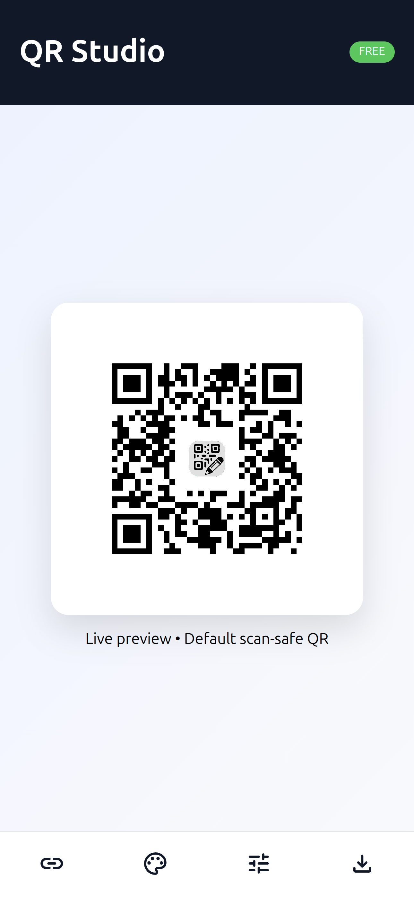

# QR Studio

[](https://shroomcoder.github.io)
[](LICENSE)

A free, modern QR code generator with advanced customization options. Create beautiful, scan-safe QR codes with gradients, custom logos, and multiple style presets.

## ✨ Features

- **🎨 Style Presets** - Choose from 4 professionally designed styles (Soft, Modern, Classy, Premium)
- **🌈 Gradient Support** - Apply beautiful gradients or create custom color combinations
- **🖼️ Logo Integration** - Add your brand logo to QR codes with automatic centering
- **📱 Fully Responsive** - Optimized for both desktop and mobile with an intuitive drawer UI
- **⚡ Real-time Preview** - See changes instantly as you customize
- **💾 Multiple Export Formats** - Download as PNG or JPG in various sizes (256px - 1024px)
- **🔒 High Error Correction** - Scan-safe QR codes with configurable error correction levels
- **🎯 Advanced Customization** - Fine-tune dot shapes, corner styles, and more

## 🚀 Live Demo

Visit the live application: [https://shroomcoder.github.io](https://shroomcoder.github.io)

<!-- QR Code to Live Site -->


## 📸 Screenshots

### Desktop View


### Mobile View


## 🛠️ Technologies Used

- **Vanilla JavaScript** - No frameworks, pure performance
- **QRCodeStyling** - Advanced QR code generation library
- **CSS3** - Modern styling with gradients and animations
- **Material Symbols** - Google's icon font for mobile UI

## 📦 Installation

1. Clone the repository:
```bash
git clone https://github.com/shroomcoder/qr-studio.git
cd qr-studio
```

2. Open `index.html` in your browser or serve with a local server:
```bash
# Using Python
python -m http.server 8000

# Using Node.js
npx serve
```

3. Visit `http://localhost:8000` in your browser

## 💻 Usage

### Basic Usage

1. Enter your URL or text in the **QR Content** field
2. Choose a style preset or customize manually
3. Optionally add your logo
4. Download in your preferred format

### Style Presets

- **Soft** - Rounded dots with smooth corners, perfect for friendly brands
- **Modern** - Extra-rounded dots with square corners, contemporary look
- **Classy** - Classic style with refined edges
- **Premium** - Classy-rounded dots for a sophisticated appearance

### Gradient Presets

Choose from 8 pre-designed gradients:
- Black & White (default)
- Neon
- Digital Sky
- Synth Dusk
- Emerald
- Sunset Candy
- Coal
- Cosmic Pop

Or create your own custom gradient!

### Advanced Options

- **Dot Shape** - Square, Rounded, Extra Rounded, Classy, or Classy Rounded
- **Corner Box Style** - Square or Rounded
- **Corner Dot Style** - Square or Dot
- **Error Correction** - Low (L), Medium (M), Quartile (Q), or High (H - recommended)
- **Logo Margin** - Adjustable spacing around your logo

## 📱 Mobile Features

The mobile interface organizes controls into 4 intuitive categories:

- 🔗 **Link** - QR content input and logo upload
- 🎨 **Palette** - Style and gradient presets
- 🎛️ **Tune** - Advanced customization options
- 💾 **Download** - Error correction, size selection, and export buttons

## 🏗️ Project Structure

```
qr-studio/
├── index.html          # Main HTML structure
├── style.css           # Responsive styling
├── script.js           # QR generation and UI logic
├── logo.png            # Default logo (optional)
├── logo.ico            # Favicon
└── README.md           # Documentation
```

## 🔧 Configuration

### Default Settings

```javascript
const DEFAULT_DATA = "https://shroomcoder.github.io";
const DEFAULT_LOGO = "logo.png";

// QR Code defaults
qrOptions: { errorCorrectionLevel: "H" }
margin: 20
width: 300px (desktop) / 260px (mobile)
```

### Customization

You can modify default values in `script.js`:

```javascript
// Change default QR size
function getQRSize() {
    return window.innerWidth <= 900 ? 260 : 300;
}

// Modify gradient presets
const gradient = {
    type: "linear",
    rotation: 45,
    colorStops: [
        { offset: 0, color: "#yourColor1" },
        { offset: 1, color: "#yourColor2" }
    ]
};
```

## 🎨 Style Customization

The application uses a clean, modern design with:
- **Primary Color**: `#111827` (Dark Gray)
- **Accent Color**: `#22c55e` (Green)
- **Background**: `#f4f6f8` (Light Gray)
- **Font**: Inter, system-ui, sans-serif

Customize these in `style.css` to match your brand.

## 🤝 Contributing

Contributions are welcome! Here's how you can help:

1. Fork the repository
2. Create a feature branch (`git checkout -b feature/AmazingFeature`)
3. Commit your changes (`git commit -m 'Add some AmazingFeature'`)
4. Push to the branch (`git push origin feature/AmazingFeature`)
5. Open a Pull Request

### Ideas for Contribution

- Additional style presets
- More gradient options
- SVG export support
- Batch QR code generation
- QR code scanning functionality
- Dark mode support
- Localization/i18n

## 📝 License

This project is licensed under the MIT License - see the [LICENSE](LICENSE) file for details.

## 🙏 Acknowledgments

- [QRCodeStyling](https://github.com/kozakdenys/qr-code-styling) - Excellent QR code generation library
- [Material Symbols](https://fonts.google.com/icons) - Google's icon font
- [Inter Font](https://rsms.me/inter/) - Beautiful typeface

## 📧 Contact

Created by [@shroomcoder](https://github.com/shroomcoder)

Project Link: [https://github.com/shroomcoder/qr-studio](https://github.com/shroomcoder/qr-studio)

---

⭐ If you find this project useful, please consider giving it a star!
